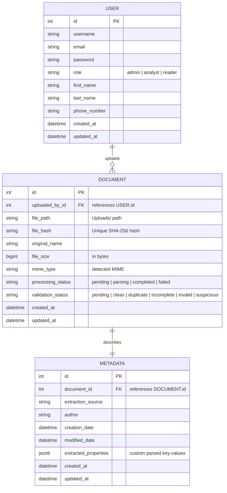

# Database Schema Entity-Relationship (ER) Diagram

This document illustrates the base database schema for Version 1 of the Enterprise AI Decision Intelligence Platform.

## Mermaid ER Diagram

---

## Entity Descriptions

### 1. User
Represents system operators. Role-based access control is evaluated using the `role` field:
- `admin`: Full system control.
- `analyst`: Can ingest files, view quality classifications, and simulate policy impact.
- `reader`: Read-only dashboard access.

### 2. Document
Tracks physical file records and ingestion statuses. The uniqueness of each file is enforced via the `file_hash` SHA-256 metric, which blocks redundant duplicate uploads.

### 3. Metadata
Contains document properties parsed during the ingestion pipelines. It maintains a 1-to-1 relationship with the Document, holding properties like authorship, system metadata, and unstructured metrics in a PostgreSQL `JSONB` structure.
