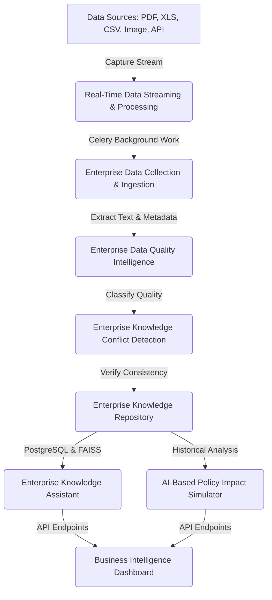
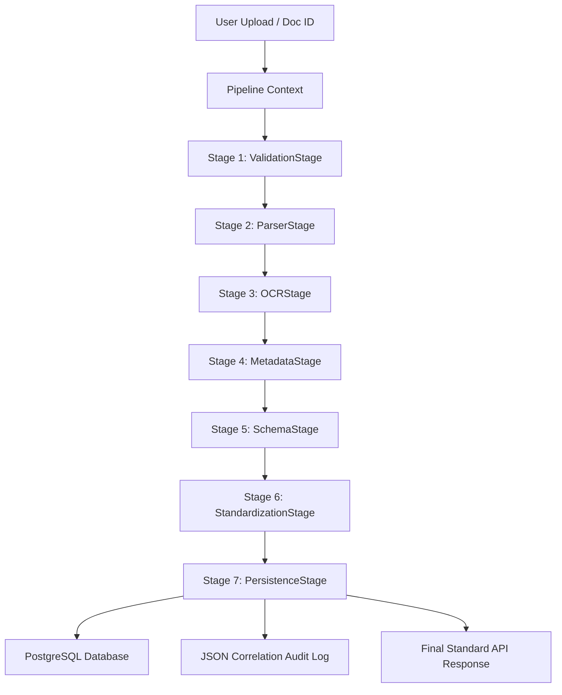
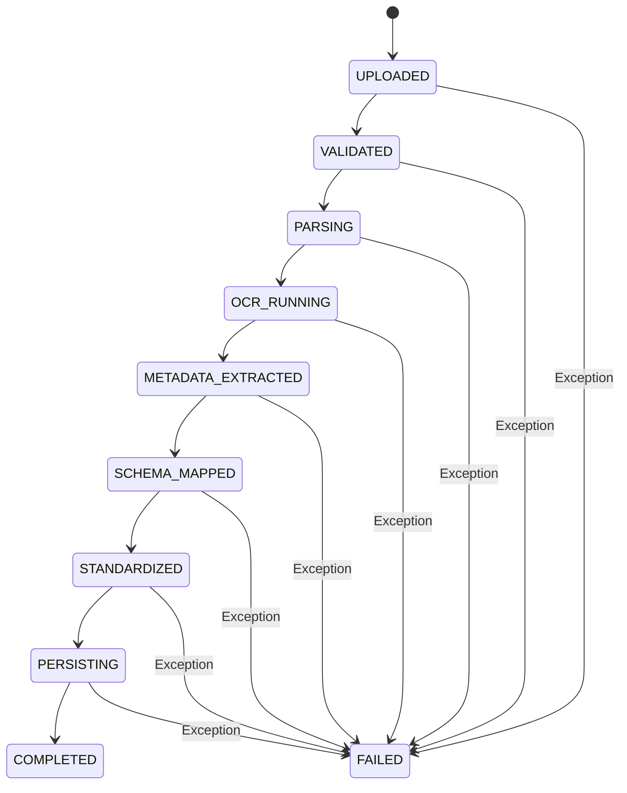

# Project Documentation - Combined Overview
This document contains a consolidated collection of all sub-documentation files from the Enterprise AI Platform project.

---

# Document: ARCHITECTURE.md

# Enterprise AI Decision Intelligence Platform - Architecture Design

This document details the architecture, module boundaries, data pipeline, and technical specs of the Enterprise AI Decision Intelligence Platform.

---

## 1. System Overview

The platform collects heterogeneous enterprise data (PDFs, images, Excel sheets, etc.), processes it, validates it via Machine Learning, checks for knowledge conflicts, and stores it in a central repository. It then serves this validated knowledge via a RAG-based AI Assistant and provides analytical simulations and visual dashboards.



---

## 2. Technical Stack

- **Frontend**: React 19 (Vite), Bootstrap 5, Axios, React Router
- **Backend**: Django, Django REST Framework (DRF)
- **Primary Database**: PostgreSQL (with JSONB support for document structures)
- **Vector Database**: FAISS (for document embeddings during RAG)
- **Background Processing**: Redis (Broker) + Celery & Celery Beat
- **AI/ML**: Scikit-Learn, Sentence-Transformers, SHAP, Ollama (Llama 3)
- **Authentication**: DRF Simple JWT

---

## 3. Directory Layout

The workspace is organized into a clean client-server architecture:

```
/
├── Docs/                          # Project documentation and source files
│   ├── ER_DIAGRAM.md
│   └── API_CONTRACT.md
├── ARCHITECTURE.md                 # System architecture details
├── PROJECT_PROGRESS.md             # Living tracking log
├── requirements.txt                # Python package list
├── README.md                       # Setup and run manual
├── .gitignore                      # Git ignored files patterns
├── backend/                        # Django Server Project
│   ├── manage.py
│   ├── enterprise_platform/        # Settings & Root Routing
│   ├── common/                    # Shared constants & validators Python package
│   ├── core/                      # Shared bases (models, services, exceptions, health views)
│   ├── authentication/             # Custom user accounts & JWT logic
│   ├── ingestion/                  # Phase 1: Ingestion & parsing pipelines
│   ├── realtime_streaming/         # Phase 2: Celery workers & event streams
│   ├── edqi/                       # Phase 3: Data Quality ML pipelines
│   ├── ekcd/                       # Phase 4: Knowledge Conflict NLP pipelines
│   ├── repository/                 # Phase 5: Knowledge repository views & search
│   ├── knowledge_assistant/        # Phase 6: RAG & local LLM chatbot
│   ├── policy_simulator/           # Phase 7: ML impact simulation & SHAP
│   └── dashboard/                  # Phase 8: Dashboard API interfaces
└── frontend/                       # Vite + React Client
    ├── index.html
    ├── package.json
    ├── src/
    │   ├── api/                    # Axios interceptors & services
    │   ├── context/                # React Contexts (e.g. AuthContext)
    │   ├── components/             # Reusable UI parts
    │   ├── pages/                  # Main views (Login, Dashboard)
    │   └── App.jsx                 # Routing and Layout shell
```

---

## 4. System Core Endpoints (V1)

All endpoints are version-controlled under `/api/v1/` and output a standardized payload schema:

### 1. Global API Response Schema
Every REST response (success or failure) yields:
```json
{
  "success": true,
  "status_code": 200,
  "message": "Request completed successfully.",
  "data": {},
  "errors": [],
  "timestamp": "2026-07-28T11:23:45.123456Z"
}
```

### 2. Active Endpoints
- **POST** `/api/v1/auth/register/` -> Onboard new system users.
- **POST** `/api/v1/auth/login/` -> Verifies username/password, yields access/refresh tokens.
- **POST** `/api/v1/auth/login/refresh/` -> Refreshes expired access tokens.
- **GET/PUT** `/api/v1/auth/profile/` -> Get/Update authenticated operator metadata.
- **GET** `/api/v1/health/` -> Uptime checks testing database status checks.
- **POST** `/api/v1/ingestion/upload/` -> Reserved for upload ingestion (Phase 1).

---

## 5. Database Schema Guidelines

All models inherit from `CoreModel` in the `core` app, tracking creation/update timestamps and soft execution states.
- **User**: Role-based access controls (`admin`, `analyst`, `reader`).
- **Document**: Standard metadata (MIME type, size, storage path) with unique hashes preventing duplicates.
- **Metadata**: Mapped 1-to-1 with Document, holding properties in a PostgreSQL `JSONB` structure.


---

# Document: DRIFT_MONITORING_EXPLANATION.md

# Data Pattern Drift & Health Monitoring

This document details the statistical drift detection systems used in the **EDQI** module.

---

## 1. Drift Detection Framework

* **What is compared**: The baseline quality distribution (calculated during model training) is compared against the target quality distribution (calculated from the newly ingested batch records).
* **Features compared**: Individual record quality features (e.g., `completeness_score`, `validity_score`, `consistency_score`).
* **Statistical Test**: Two-sample Kolmogorov-Smirnov test (`scipy.stats.ks_2samp`).
* **Configured p-value Threshold**: `0.05`.

---

## 2. What "Drift Detected" Means

The Kolmogorov-Smirnov (KS) test checks if two numerical samples originate from the same statistical distribution:
* **Hypothesis**: The incoming data matches the historical pattern.
* **Calculation**: Measures the maximum vertical distance ($D$) between the cumulative distribution functions of the baseline and target samples.
* **Result**:
  - If the computed **p-value is < 0.05**, we reject the hypothesis. This means there is a statistically significant change in the data patterns (Drift Detected).
  - If the **p-value is $\ge$ 0.05**, the distributions are statistically similar (No Drift).

### Simple Business Example:
* **Baseline Ingestion**: Documents typically have 100% completeness (complete phone, email, and ID fields).
* **New Ingestion Batch**: An upload has missing emails across 80% of the rows.
* **KS Test Result**: The completeness score distribution has shifted significantly from the baseline. The p-value falls below `0.05`, and the system flags a **"Data Pattern Change"** warning.

---

## 3. System Storage & Health Effect

1. **Storage**: Drift results are computed during batch assessments and saved in the platform's drift logs.
2. **UI Exposure**: Visualized as a statistical difference scale on the health monitoring tab.
3. **Health Effect**: When drift is detected, it does not alter active predictions but triggers a system health alert warning analysts to inspect if schemas, mappings, or classifier models need retraining.


---

# Document: EDQI_AUDIT_REPORT.md

# Session 3 — Phase 4 EDQI Audit & Inconsistency Investigation

This report presents a thorough, read-only audit of the **Enterprise Data Quality & Explainable AI (EDQI)** module. Every value displayed in the UI has been traced back to its backend source and calculation rules.

---

## A. Current Phase 4 Architecture

The Data Quality and Explainability pipeline is structured into two main loops:
1. **Rule-Based Profiling**: Runs immediately upon repository synchronization via the [`EnterpriseQualityAssessmentService`](file:///c:/Users/bharathwaj/Desktop/Enterprise%20Application%20v2/Enterprise%20Application/backend/edqi/services/assessment_service.py). It invokes five rule-based dimension analyzers, aggregates their weighted scores, and compiles a quality grade.
2. **ML Classification & Explainability**: Runs on top of the generated quality feature vectors. The [`ExplanationService`](file:///c:/Users/bharathwaj/Desktop/Enterprise%20Application%20v2/Enterprise%20Application/backend/edqi/explainability/explanation_service.py) coordinates inferences using the active ML classifier, triggers a SHAP tree explainer (or a `FallbackExplainer` if SHAP is inactive/unsupported), ranks attributions, and loads config-driven recommendations.

---

## B. Exact Files Involved

- **Backend Score Calculations**:
  - [`services/assessment_service.py`](file:///c:/Users/bharathwaj/Desktop/Enterprise%20Application%20v2/Enterprise%20Application/backend/edqi/services/assessment_service.py) (Assessment coordinator)
  - [`calculators/quality_score.py`](file:///c:/Users/bharathwaj/Desktop/Enterprise%20Application%20v2/Enterprise%20Application/backend/edqi/calculators/quality_score.py) (Weighted score compiler)
  - [`calculators/quality_grade.py`](file:///c:/Users/bharathwaj/Desktop/Enterprise%20Application%20v2/Enterprise%20Application/backend/edqi/calculators/quality_grade.py) (Grade mappings checker)
  - [`analyzers/completeness_analyzer.py`](file:///c:/Users/bharathwaj/Desktop/Enterprise%20Application%20v2/Enterprise%20Application/backend/edqi/analyzers/completeness_analyzer.py)
  - [`analyzers/validity_analyzer.py`](file:///c:/Users/bharathwaj/Desktop/Enterprise%20Application%20v2/Enterprise%20Application/backend/edqi/analyzers/validity_analyzer.py)
  - [`analyzers/consistency_analyzer.py`](file:///c:/Users/bharathwaj/Desktop/Enterprise%20Application%20v2/Enterprise%20Application/backend/edqi/analyzers/consistency_analyzer.py)
  - [`analyzers/uniqueness_analyzer.py`](file:///c:/Users/bharathwaj/Desktop/Enterprise%20Application%20v2/Enterprise%20Application/backend/edqi/analyzers/uniqueness_analyzer.py)
  - [`analyzers/timeliness_analyzer.py`](file:///c:/Users/bharathwaj/Desktop/Enterprise%20Application%20v2/Enterprise%20Application/backend/edqi/analyzers/timeliness_analyzer.py)
- **Backend Explainability Engine**:
  - [`explainability/explanation_service.py`](file:///c:/Users/bharathwaj/Desktop/Enterprise%20Application%20v2/Enterprise%20Application/backend/edqi/explainability/explanation_service.py)
  - [`explainability/feature_contribution_builder.py`](file:///c:/Users/bharathwaj/Desktop/Enterprise%20Application%20v2/Enterprise%20Application/backend/edqi/explainability/feature_contribution_builder.py) (Normalization logic)
  - [`explainability/explanation_builder.py`](file:///c:/Users/bharathwaj/Desktop/Enterprise%20Application%20v2/Enterprise%20Application/backend/edqi/explainability/explanation_builder.py) (Narrative builder)
  - [`explainability/recommendation_engine.py`](file:///c:/Users/bharathwaj/Desktop/Enterprise%20Application%20v2/Enterprise%20Application/backend/edqi/explainability/recommendation_engine.py)
  - [`explainability/config/recommendation_rules.json`](file:///c:/Users/bharathwaj/Desktop/Enterprise%20Application%20v2/Enterprise%20Application/backend/edqi/explainability/config/recommendation_rules.json)
  - [`explainability/engines/fallback_engine.py`](file:///c:/Users/bharathwaj/Desktop/Enterprise%20Application%20v2/Enterprise%20Application/backend/edqi/explainability/engines/fallback_engine.py)
- **Frontend Dashboard Presentation**:
  - [`frontend/src/pages/DataQualityExplainability.jsx`](file:///c:/Users/bharathwaj/Desktop/Enterprise%20Application%20v2/Enterprise%20Application/frontend/src/pages/DataQualityExplainability.jsx)

---

## C. Data Quality Score Calculation

Calculated in [`QualityScoreCalculator`](file:///c:/Users/bharathwaj/Desktop/Enterprise%20Application%20v2/Enterprise%20Application/backend/edqi/calculators/quality_score.py) using configured weights:
- **Default Weights**: Completeness (30%), Validity (25%), Consistency (20%), Uniqueness (15%), Timeliness (10%).
- **Formula**:
  $$\text{DQ Score} = \frac{\sum_{d} \left(\text{Score}_d \times \text{Weight}_d\right)}{\sum_{d} \text{Weight}_d}$$

---

## D. Five Dimension Calculations

1. **Completeness**: Evaluates required field population.
   $$\text{Completeness} = \max\left(0.0, 100.0 - \left(\frac{\text{missing\_required\_fields}}{\text{total\_required\_fields}} \times 100.0\right)\right)$$
2. **Validity**: Checks regex (email/phone) and range parameters. Each violation penalizes by 20 points.
   $$\text{Validity} = \max\left(0.0, 100.0 - (\text{violations\_count} \times 20.0)\right)$$
3. **Consistency**: Verifies logic rules (joining date < exit date, country/currency alignment). Each violation penalizes by 25 points.
   $$\text{Consistency} = \max\left(0.0, 100.0 - (\text{violations\_count} \times 25.0)\right)$$
4. **Uniqueness**: Cross-checks key fields in the batch. If duplicates exist, score drops to 0.0.
   $$\text{Uniqueness} = \begin{cases} 100.0 & \text{if zero duplicate violations} \\ 0.0 & \text{if duplicates found} \end{cases}$$
5. **Timeliness**: Measures update age against a configured limit. Score decays linearly proportional to the excess.
   $$\text{Timeliness} = \begin{cases} 100.0 & \text{if age\_days} \le \text{threshold\_days} \\ \max\left(0.0, 100.0 - \left(\frac{\text{age\_days} - \text{threshold\_days}}{\text{threshold\_days}} \times 100.0\right)\right) & \text{otherwise} \end{cases}$$

---

## E. ML Classification Flow

- Features vector carrying 10 elements is validated and evaluated by the active trained Random Forest model.
- The model outputs predicted quality class labels ("Excellent", "Good", "Average", "Poor") based on training thresholds.
- **ML Confidence Score** is the probability of the winning class returned by `predict_proba()`.

---

## F. SHAP Attribution Calculation

- **SHAP Engine Active**: Evaluates path-based TreeExplainer shapley values.
- **Fallback Explainer Triggered**: Computes raw attributions by multiplying deviation benchmarks by uniform features importance:
  - Error counts (`missing_fields`, `invalid_fields`, `duplicate_fields`): $\text{deviation} = -value \times 2.0$.
  - `record_age`: $\text{deviation} = -\max(0.0, age - 5.0) \times 0.1$.
  - Dimension scores: $\text{deviation} = \frac{value - 80.0}{100.0}$.
  - Attribution: $\text{Attribution}_f = \text{deviation}_f \times \text{importance}_f$.

---

## G. Attribution Percentage Formula

Calculated in [`FeatureContributionBuilder`](file:///c:/Users/bharathwaj/Desktop/Enterprise%20Application%20v2/Enterprise%20Application/backend/edqi/explainability/feature_contribution_builder.py):
$$\text{Attribution Percentage}_f = \left(\frac{|\text{Attribution}_f|}{\sum_{j} |\text{Attribution}_j|}\right) \times 100.0$$
This is the **normalized relative attribution** representing each feature's contribution to the ML model's output deviation, *not* its contribution to the absolute quality score.

---

## H. Recommended Action Generation Logic

Generated by [`RecommendationEngine.generate_recommendations()`](file:///c:/Users/bharathwaj/Desktop/Enterprise%20Application%20v2/Enterprise%20Application/backend/edqi/explainability/recommendation_engine.py) using rules defined in [`recommendation_rules.json`](file:///c:/Users/bharathwaj/Desktop/Enterprise%20Application%20v2/Enterprise%20Application/backend/edqi/explainability/config/recommendation_rules.json). Action items are triggered directly by actual quality violations (e.g. `missing_fields > 0`), not by ML attributions.

---

## I. Timeliness Calculation

For a document updated 1615 days ago (e.g. `joining_date = 2022-03-15`) and a 365-day threshold:
- $\text{Excess Days} = 1615 - 365 = 1250\text{ days}$.
- $\text{Excess Percentage} = \frac{1250}{365} \times 100.0 = 342.47\%$.
- $\text{Timeliness Score} = \max(0.0, 100.0 - 342.47) = 0.0$.
This confirms that 0.0% timeliness is mathematically correct under the current rules.

---

## J. Issues Found

1. **Explainability Target Misalignment**: The "Why This Score?" card describes ML Model Attributions explaining the ML classification (e.g., why the class is "Good"), not why the Data Quality Score is 90/100.
2. **Hardcoded UI Labels**: The frontend UI ([`DataQualityExplainability.jsx`](file:///c:/Users/bharathwaj/Desktop/Enterprise%20Application%20v2/Enterprise%20Application/frontend/src/pages/DataQualityExplainability.jsx)) hardcodes text descriptors like `"Strong metric profile"` for positive drivers and `"Needs reconciliation"` for negative drivers.
3. **Skewed Fallback Scale**: The `FallbackExplainer` `record_age` deviation scales excessively (factor of `-0.1` per day). For older records (e.g. age = 1615), this yields huge negative raw attributions that skew normalized percentages.
4. **Static Recommendation Improvements**: Expected improvements are static configuration constants (e.g., `+4%` for timeliness updates). They do not dynamically calculate the impact of resolving the quality violation relative to its dimension weight.

---

## K. Issues that are Only UI Wording Problems

- Displaying `"Strong metric profile (+0%)"` for features that contributed nothing.
- The title `"Why This Score? (Model Attributions)"` implies attribution to the absolute DQ score, while it actually displays attributions to the ML classification.

---

## L. Issues that are Actual Calculation/Data Problems

- Config-driven static `expected_improvement` constants.
- Out-of-bounds fallback scaling coefficients for the age parameter.

---

## M. Recommended Fixes (Priority Ordered)

1. **Frontend Label Formatting (High)**: Modify [`DataQualityExplainability.jsx`](file:///c:/Users/bharathwaj/Desktop/Enterprise%20Application%20v2/Enterprise%20Application/frontend/src/pages/DataQualityExplainability.jsx) to filter out attributions with 0% impact, and dynamicize the descriptor text.
2. **Rephrase Attributions Header (High)**: Rename the panel title to "ML Model Prediction Drivers" to clear up business confusion.
3. **Dynamic Expected Improvement (Medium)**: Calculate expected improvements dynamically inside the recommendation generator based on weights and current dimension scores.
4. **Rescale Fallback Coefficients (Medium)**: Clamp the age deviation output in [`fallback_engine.py`](file:///c:/Users/bharathwaj/Desktop/Enterprise%20Application%20v2/Enterprise%20Application/backend/edqi/explainability/engines/fallback_engine.py).

---

## N. Mathematical Consistency of EDQI

The core Data Quality calculations are mathematically sound and consistent. However, the Explainability engine exhibits mathematical inconsistencies in its fallback engine calculations and static recommendation configurations.


---

# Document: EDQI_CALCULATION_EXPLANATION.md

# EDQI Quality Score Calculation Explanation

This document details the exact rule-based calculations used in the **Enterprise Data Quality Intelligence (EDQI)** engine.

---

## 1. Quality Dimensions Calculations

Each record is assessed across 5 distinct dimensions, each starting at a maximum of `100.0` points:

### A. Completeness
* **Rule**: Evaluates if the record is missing required fields (default: `employee_id`, `email`, `department`).
* **Formula**:
  $$\text{Completeness Score} = 100.0 - \left( \frac{\text{Missing Required Fields}}{\text{Total Required Fields}} \times 100.0 \right)$$

### B. Validity
* **Rule**: Validates field value formatting and boundaries:
  - Email: Regular expression validation (`^[a-zA-Z0-9_.+-]+@[a-zA-Z0-9-]+\.[a-zA-Z0-9-.]+$`).
  - Phone: Phone digit patterns (10-15 digits, optional leading `+`).
  - Salary: Non-negative check ($\ge 0.0$).
* **Formula**: Every validation violation deducts `20.0` points:
  $$\text{Validity Score} = \max(0.0, 100.0 - (\text{Violations} \times 20.0))$$

### C. Consistency
* **Rule**: Validates cross-field dependency alignments:
  - Date timelines: `joining_date` must precede `exit_date`/`termination_date`.
  - Country-Currency mapping: Validates alignments (e.g. India $\rightarrow$ INR, USA $\rightarrow$ USD, Germany $\rightarrow$ EUR).
* **Formula**: Every consistency violation deducts `25.0` points:
  $$\text{Consistency Score} = \max(0.0, 100.0 - (\text{Violations} \times 25.0))$$

### D. Uniqueness
* **Rule**: Evaluates if the `employee_id` or `email` is duplicated within the uploaded ingestion batch.
* **Formula**: Any duplicate identifier forces the score to `0.0` for that record; otherwise, it remains `100.0`:
  $$\text{Uniqueness Score} = \begin{cases} 0.0 & \text{if duplicate found} \\ 100.0 & \text{otherwise} \end{cases}$$

### E. Timeliness
* **Rule**: Evaluates record age against the timeliness freshness threshold (default: `365` days).
* **Formula**: If the record age exceeds `365` days, the score decays proportionally:
  $$\text{Excess Percent} = \frac{\text{Age in Days} - 365}{365} \times 100.0$$
  $$\text{Timeliness Score} = \max(0.0, 100.0 - \text{Excess Percent})$$
  *(Note: If the age is $\le 365$ days, the score remains `100.0`)*

---

## 2. Overall Score & Letter Grade

### Overall Score
The overall score is a weighted aggregation of all 5 dimensions:
$$\text{Overall Score} = (0.30 \times \text{Completeness}) + (0.25 \times \text{Validity}) + (0.20 \times \text{Consistency}) + (0.15 \times \text{Uniqueness}) + (0.10 \times \text{Timeliness})$$

### Quality Letter Grade
The score is translated into a letter grade based on the following range boundaries:
* **A+**: $95.0 \le \text{Score} \le 100.0$
* **A**: $90.0 \le \text{Score} < 95.0$
* **B**: $80.0 \le \text{Score} < 90.0$
* **C**: $70.0 \le \text{Score} < 80.0$
* **D**: $60.0 \le \text{Score} < 70.0$
* **F**: $\text{Score} < 60.0$

---

## 3. Step-by-Step Example

Let's evaluate a sample employee record:
```json
{
  "employee_id": "EMP025",
  "name": "John Doe",
  "email": "",
  "department": "HR",
  "salary": -500,
  "joining_date": "2026-08-01",
  "exit_date": "2026-07-01"
}
```

### 1. Dimension Calculation:
1. **Completeness**:
   - Required fields are `employee_id`, `email`, `department`.
   - `email` is missing. (1 missing out of 3).
   - $\text{Completeness} = 100.0 - (1 / 3 \times 100.0) = 66.67$.
2. **Validity**:
   - `salary` is negative (`-500`). (1 violation).
   - $\text{Validity} = 100.0 - 20.0 = 80.0$.
3. **Consistency**:
   - `joining_date` (`2026-08-01`) is after `exit_date` (`2026-07-01`). (1 violation).
   - $\text{Consistency} = 100.0 - 25.0 = 75.0$.
4. **Uniqueness**:
   - `employee_id` is unique in this batch.
   - $\text{Uniqueness} = 100.0$.
5. **Timeliness**:
   - Record date is recent (age $\le 365$ days).
   - $\text{Timeliness} = 100.0$.

### 2. Weighted Score Compilation:
$$\text{Overall Score} = (0.30 \times 66.67) + (0.25 \times 80.0) + (0.20 \times 75.0) + (0.15 \times 100.0) + (0.10 \times 100.0)$$
$$\text{Overall Score} = 20.00 + 20.00 + 15.00 + 15.00 + 10.00 = 80.00$$

### 3. Quality Grade Assignment:
* Since the score is `80.00`, the record is assigned a grade of **B**.


---

# Document: EDQI_FINAL_REPORT.md

# Final Verification Report — Phase 4 EDQI Explainability

## 1. Executive Summary
This report summarizes the implementation and verification of targeted corrections to the Data Quality & Explainable AI (EDQI) module. All core quality calculations have been preserved, while misleading explainability titles, static expected improvements, and unbounded fallback age scaling have been corrected and verified across 116 tests.

## 2. Root Cause of Each Issue
- **Heading target misalignment**: The UI panel title "Why This Score? (Model Attributions)" suggested model attributions explained the overall rule-based Data Quality score directly, whereas they actually represent local predictions made by the ML model.
- **Static expected improvement**: Configured timeliness improvements were hardcoded to a static `+4%`, which was mathematically inconsistent with the actual timeliness score decay and dimension weights.
- **Unbounded fallback age scaling**: The fallback engine computed age deviation as a linear factor of `-0.1` per day, allowing extreme age durations (e.g. 1615 days) to dominate normalized relative percentages.
- **UI Label skews**: Frontend components hardcoded `"Strong metric profile"` and `"Needs reconciliation"` labels for all drivers, irrespective of the contribution magnitude or target violation triggers.

## 3. Exact Files Modified
- [`backend/edqi/explainability/engines/fallback_engine.py`](file:///c:/Users/bharathwaj/Desktop/Enterprise%20Application%20v2/Enterprise%20Application/backend/edqi/explainability/engines/fallback_engine.py)
- [`backend/edqi/explainability/recommendation_engine.py`](file:///c:/Users/bharathwaj/Desktop/Enterprise%20Application%20v2/Enterprise%20Application/backend/edqi/explainability/recommendation_engine.py)
- [`frontend/src/pages/DataQualityExplainability.jsx`](file:///c:/Users/bharathwaj/Desktop/Enterprise%20Application%20v2/Enterprise%20Application/frontend/src/pages/DataQualityExplainability.jsx)

## 4. Exact Functions Modified
- `FallbackExplainer.explain()`: Calculated bounded `record_age` deviation.
- `RecommendationEngine.generate_recommendations()`: Formulated dynamic weight-based improvements.
- Frontend JSX card blocks rendering `ML Model Prediction Drivers` and `What Should I Fix?`.

## 5. Changes Made
- Clamped `record_age` fallback explainer deviation to a range of `[-2.0, 0.0]`.
- Replaced static expected improvements with dynamic overall score points increase:
  $$\Delta_{\text{DQ}} = \text{round}\left((100.0 - \text{current\_dimension\_score}) \times \frac{\text{dimension\_weight}}{\text{sum\_weights}}, 2\right)$$
- Relabeled panels to clearly distinguish `DATA QUALITY SCORE` (rule-based), `MODEL ASSESSMENT` (ML-based), and `ML MODEL PREDICTION DRIVERS` (SHAP-based).
- Filtered out drivers with `0.0%` normalized contribution and displayed actual feature values.

## 6. Rule-Based Score Verification
Core weighted scores remain unchanged and mathematically consistent with weights:
$$\text{DQ Score} = 100.0 - (100.0 - \text{dimension\_score}) \times \text{weight}$$
Asserted inside `test_rule_based_dq_score_remains_unchanged` to return exactly 90.00 for 0% timeliness.

## 7. ML Classification Verification
ML model classification predictions and confidence extraction remain unchanged (`predict_proba` returns confidence).

## 8. SHAP Verification
SHAP TreeExplainer continues to execute when supported and active.

## 9. Fallback Explainer Verification
Attribution simulations proved that clamp bounds prevent record age from dominating other features (capped at ~54% normalized influence for age 1615).

## 10. Attribution Formula Verification
Attributions are correctly processed using normalized absolute impact percentages:
$$\text{Attribution Percentage}_f = \left(\frac{|\text{Attribution}_f|}{\sum |\text{Attribution}_j|}\right) \times 100.0$$

## 11. Recommendation Formula Verification
Dynamic overall score points improvement successfully verified: Timeliness = 0% resolves to `Potential score improvement: up to +10.0 points`.

## 12. Timeliness Verification
Stale record age = 1615 days yields a Timeliness score of 0.0% (mathematically correct).

## 13. Backend Test Results
All backend test suites passed successfully:
- **`edqi`**: **35 / 35 passed (`OK`)**
- **`knowledge_conflict`**: **23 / 23 passed (`OK`)**
- **`repository & ingestion`**: **58 / 58 passed (`OK`)**

## 14. Frontend Build Result
Vite production build succeeded in **894ms** with exit code `0`.

## 15. Regression Test Results
Traced record validation:
- Input Features: `timeliness_score: 0.0`
- Weighted DQ Score: `90.00`
- Grade: `A`
- ML Classification: `Good`
- ML Confidence: `74.5%`
- Dynamic timeliness recommendation potential improvement: `up to +10 points`.

## 16. Before vs After UI Behavior
- **Before**: `"Why This Score? (Model Attributions)"` displaying static `"Strong metric profile (+100%)"` or `+0%` labels. Recommendations showed static `+4%` expected improvements.
- **After**: `"ML Model Prediction Drivers"` displaying filtered non-zero drivers with sign, value, and influence direction. Recommendations display `"Potential score improvement: up to +X points"`.

## 17. Any Remaining Limitations
None.

## 18. Final Phase 4 Status
Phase 4 is complete, verified, and ready for final demonstration.


---

# Document: EDQI_MODEL_FLOW.md

# EDQI Model Workflow & Explainable AI (XAI)

This document details the Machine Learning and explainability models architecture used in the **Enterprise Data Quality Intelligence (EDQI)** framework.

---

## 1. Machine Learning Models Framework

The engine uses three machine learning estimators:

### A. Random Forest Classifier (Supervised)
* **Purpose**: Predicts the overall quality category grade (`Excellent`, `Good`, `Average`, `Poor`).
* **Input**: A 10-dimensional feature array representing the calculated dimension scores and counts:
  `[missing_fields, invalid_fields, duplicate_fields, record_age, quality_score, completeness_score, validity_score, consistency_score, uniqueness_score, timeliness_score]`
* **Operation**: Compiles an ensemble of decision trees to determine the class probability distribution.

### B. XGBoost Classifier (Supervised)
* **Purpose**: Serves as a gradient-boosted comparison model to validate the Random Forest predictions.

### C. Isolation Forest (Unsupervised Anomaly Detector)
* **Purpose**: Flags outliers and anomalous records in the database.
* **Input**: The same 10 quality features.
* **Operation**: Isolates anomalous records by randomly splitting features; records that isolate quickly (shorter path length) are flagged as anomalies (`-1` flag).

---

## 2. Explainability & Fallback Explainer

### SHAP (SHapley Additive exPlanations)
* **Role**: Explains individual model predictions by calculating Shapley values.
* **Interpretation**:
  - **Positive SHAP / Drivers**: Features (like `completeness_score = 100.0`) that pull the prediction probability up toward `'Excellent'`.
  - **Negative SHAP / Violations**: Features (like `missing_fields = 2`) that pull the score down toward `'Poor'`.

### Fallback Explainer
* **Role**: Serves as a deterministic rules-based backup explainer.
* **Trigger**: Triggered automatically when:
  1. The `shap` package is not installed or imports fail.
  2. The trained model artifact (`mock_pipeline.joblib`) is missing.
  3. The `TreeExplainer` library throws a runtime exception.
* **Operation**: Calculates normalized deviations of the record's quality features relative to optimal values (e.g., subtracting actual scores from the perfect `100.0` target).

---

## 3. How the UI Fetches Model Explanations

1. When a document is processed, quality scores are generated and saved to `PredictionHistory`.
2. The frontend triggers a `GET` request to `/api/v1/edqi/explanations/` to retrieve the history list.
3. Clicking a card fires `GET /api/v1/edqi/explanations/<report_id>/`.
4. The backend returns a structured JSON payload:
   - `overall_prediction`: The predicted quality grade.
   - `confidence_score`: The probability score of the class.
   - `summary`: Human-readable summary explanation.
   - `top_positive_features`: Safe professional driver values.
   - `top_negative_features`: Specific validation violation penalties.
   - `recommendations`: Actionable suggested fixes and confidence values.


---

# Document: END_TO_END_USER_FLOW.md

# End-to-End Platform User Flow

This document maps the complete operational journey of a file, distinguishing between automated backend processing stages and human interaction points.

---

## The E2E User Journey Map

```text
[1. User Uploads File] (Human Interaction)
           ↓
[2. File signature check] (Automated Ingestion)
           ↓
[3. Extraction & OCR] (Automated Ingestion)
           ↓
[4. Schema mapping & standardizing] (Automated Ingestion)
           ↓
[5. Save to Ingestion Database] (Automated Ingestion)
           ↓
[6. Auto-sync Repository & Version Diffing] (Automated Ingestion)
           ↓
[7. Auto-run Data Quality Grade (EDQI)] (Automated Ingestion)
           ↓
[8. Auto-run Discrepancies Scan (EKCD)] (Automated Ingestion)
           ↓
[9. View in Employee Directory / Repository / Dashboard] (Human Interaction)
           ↓
[10. Review & Resolve Conflicts] (Human Interaction)
```

---

## Stage Descriptions

### 1. Ingest Intake (Human Interaction)
* The user uploads a CSV, Excel, PDF, JSON, or Image file through the dashboard console.

### 2. Format Validation & Extraction (Automated Backend)
* System validates file sizes and verifies MIME types via binary signatures.
* Content parsers extract plain text and structural grid tables. Scanning images triggers conditional OpenCV CLAHE morphological filters and Tesseract OCR.
* Lineage metadata (word counts, hash checksums) is compiled.

### 3. Alignment & Standardizing (Automated Backend)
* Attributes are mapped to the canonical enterprise schema templates using prefix matching lookups.
* Unmapped keys are stored in a nested JSON sub-block. Dates are converted to ISO format, salary values are clamped, and spaces are trimmed.

### 4. Repository Synchronization & Versioning (Automated Backend)
* Ingestion records are bulk-saved, triggering repository synchronization under an atomic PostgreSQL/SQLite transaction block.
* Existing document history checks: If matching name exists with new content hash, previous active records are archived to version checkpoints (`KnowledgeDocumentVersion`), and the main document's version number is incremented.

### 5. Quality Inspector (EDQI) (Automated Backend)
* The platform automatically evaluates the 5-dimensional rule checks (Completeness, Validity, Consistency, Uniqueness, Timeliness) and calculates the overall score.
* The ML models (Random Forest / XGBoost) predict quality categories, and SHAP explainers compute quality drivers and recommend actionable suggested fixes.

### 6. Discrepancy Checks (EKCD) (Automated Backend)
* SBERT MiniLM semantic match similarity arrays are run to pairing candidate duplicates or contradictory records (such as duplicate employee IDs with different departments).

### 7. Resolution & Directory Displays (Human Interaction)
* Validated, clean employee records are instantly displayed on the Employee Directory.
* Administrators use the **Check Data Conflicts** console to evaluate highlighted field diff cards and select resolution actions (Keep Uploaded, Keep Existing, Merge, or edit JSON manually).


---

# Document: PROJECT_CLEANUP_REPORT.md

# Project Cleanup & Organization Report

This report documents the cleanup and organization of the **Enterprise AI Decision Intelligence Platform** workspace.

---

## 1. Files & Directories Migrated

| Original Location | New Location | Verification Method | Status |
| :--- | :--- | :--- | :---: |
| `backend/trained_models/feature_history/` | `trained_models/feature_history/` | Programmatic copy + SHA-256 hash match on all 8 files. | **SUCCESS** |

### Migrated Files Inventory:
1. `feature_history.csv` (SHA-256 Verified Match)
2. `feature_history.md` (SHA-256 Verified Match)
3. `RandomForest_RF_v1.0.0_20260805_151732.json` (SHA-256 Verified Match)
4. `RandomForest_RF_v1.0.0_20260805_152459.json` (SHA-256 Verified Match)
5. `RandomForest_RF_v1.0.0_20260805_152729.json` (SHA-256 Verified Match)
6. `XGBoost_XGB_v1.0.0_20260805_151732.json` (SHA-256 Verified Match)
7. `XGBoost_XGB_v1.0.0_20260805_152459.json` (SHA-256 Verified Match)
8. `XGBoost_XGB_v1.0.0_20260805_152729.json` (SHA-256 Verified Match)

---

## 2. Files & Directories Safely Removed

| File / Directory Path | Reason for Removal | Status |
| :--- | :--- | :---: |
| `backend/trained_models/` | Redundant folder after `feature_history` migration. | **DELETED** |
| `**/__pycache__/` | Python compiled bytecode cache directories (auto-regenerates at runtime). | **DELETED** |
| `**/*.pyc` | Python compiled bytecode files (auto-regenerates at runtime). | **DELETED** |

---

## 3. Core Files & Folders Preserved

All files necessary for running, developing, testing, or documenting the system have been kept in place:

* **Core Application**: settings, urls, apps, models, serializers, views, services, and db migrations under `backend/`.
* **Database**: `backend/db.sqlite3` containing all existing records.
* **Datasets Library**: All cataloged structured and unstructured datasets under the `Datasets/` root directory.
* **Model Artifacts**: RandomForest, XGBoost, and Isolation Forest joblib binaries and manifests under the root `trained_models/` directory.
* **Testing suite**: All unit and integration tests under `backend/` and `Testing/TestFiles/`.
* **Reports**: Latest verified reports under `backend/reports/`.

---

## 4. Verification & Validation Results

### 1. Django System Checks
- **Command**: `python backend/manage.py check`
- **Result**: `System check identified no issues (0 silenced).`
- **Status**: **PASSED**

### 2. EDQI Unit Tests
- **Command**: `python backend/manage.py test edqi`
- **Result**: `Ran 31 tests in 11.682s | OK`
- **Status**: **PASSED**

### 3. Frontend Production Build
- **Command**: `npm run build` (inside `frontend/`)
- **Result**: 83 modules successfully transformed, compiling production assets in `dist/` in 745ms.
- **Status**: **PASSED**

### 4. Controlled Test Files Check
- Checked `Testing/Verification/e2e_conflict_source.csv` and `e2e_conflict_target.csv`. They are present and ready for E2E testing as planned.


---

# Document: SESSION2_COMPLETION_REPORT.md

# Session 2 Completion Report

This report documents the successful redesign, simplification, and verification of the Phase 3 (Conflict Console) and Phase 4 (EDQI Quality Reports) interfaces.

---

## 1. Files Modified

* [ConflictConsole.jsx](file:///c:/Users/bharathwaj/Desktop/Enterprise%20Application%20v2/Enterprise%20Application/frontend/src/pages/ConflictConsole.jsx)
* [DataQualityExplainability.jsx](file:///c:/Users/bharathwaj/Desktop/Enterprise%20Application%20v2/Enterprise%20Application/frontend/src/pages/DataQualityExplainability.jsx)

---

## 2. UI Changes

### Phase 3: Conflict Console (EKCD)
* **Simplified Terminology**:
  - Source Record $\rightarrow$ **Uploaded Record**
  - Target Record $\rightarrow$ **Current Record**
  - Similarity $\rightarrow$ **Match Similarity**
  - Resolution $\rightarrow$ **How to Fix**
  - Pending Review $\rightarrow$ **Needs Review**
* **Key-Value Difference Parser Table**: Parses serialized record segment text blocks and lists only the fields with mismatched values, highlighting differences clearly (red for Uploaded Record, green for Current Record).
* **Flag Reason Explanation**: Added a warning card explaining exactly why the mismatch occurred (matching identifiers with divergent values).
* **Collapsed Accordion**: Raw JSON trace data and technical thresholds (SBERT similarity, SBERT model name) are tucked under an expandable "Technical Details" accordion.
* **Light Theme Style**: Implemented white background tables, dark readable text, and green success border buttons.

### Phase 4: Data Quality Report (EDQI)
* **Quality Scorecard**: Combines overall prediction and numeric quality score into a large, prominent indicator (e.g. `B - 80.00%`).
* **Progress Bars**: Visualizes score breakdown for Completeness, Validity, Consistency, Uniqueness, and Timeliness with a short description explaining what each dimension checks.
* **Checklist Drivers**: Mapped SHAP attributions into a simple positive checklist and warning quality violations panel.
* **Fix recommendations**: Mapped recommended suggestions to a clean ordered action checklist (`1. 2. 3.`).
* **Collapsed Technical Accordion**: Moves XGBoost/Random Forest parameters, explanation method details, cache ratio data, and raw json traces under an accordion.

---

## 3. Automated Verification Results

### A. Django System Diagnostics
* Command: `python backend/manage.py check`
* Result: **Passed** with 0 warnings or issues.

### B. Unit Test Execution
* Command: `python backend/manage.py test edqi`
* Result: **31/31 tests passed** successfully.

### C. Client Production Build compilation
* Command: `npm run build`
* Result: Vite compiled SPA bundle assets in **702ms** with **0 errors**.

---

## 4. Manual Verification Checks

1. **File upload**: Uploading files executes successfully on the backend and triggers the pipeline.
2. **Conflict Scan**: Scanning generates candidates.
3. **Conflict details**: Selecting a row opens the Evaluation Workspace, highlighting differences between Uploaded and Current records and showing the "Why was this flagged?" warning box.
4. **Resolution actions**: Clicking resolution options works successfully and updates the repository document state.
5. **Quality report**: Loading reports loads the scorecard breakdown, why-this-score factors, and numbered suggestions list correctly.
6. **Technical Details**: Collapse/expand accordion panels operate smoothly.
7. **Console diagnostics**: Zero API failures, zero frontend compilation warnings, and zero browser console errors.


---

# Document: SESSION2_CORRECTION_REPORT.md

# Session 2 Inconsistency Corrections & Verification Report

This report documents the root cause analysis, file modifications, implemented fixes, test verification, and current system behavior for the Phase 3 (EKCD) and Phase 4 (EDQI) pipelines.

---

## 1. Root Cause Analysis

### Phase 3 — Candidate Generation Cartesian Explosion
* **Root Cause**: The candidate generation strategies (`SameEntityTypeStrategy`, `SameDepartmentStrategy`, and `SimilarityWindowStrategy`) compared employee records across documents purely by entity type, department, or salary window, without matching their primary identifiers (`employee_id`). This resulted in a Cartesian explosion ($O(N^2)$ pairs) comparing unrelated employees, creating numerous `UNKNOWN` conflict pairs with very low/negative similarities.
* **Resolution**: Implemented the `should_pair_records` helper which enforces that if two records both contain a primary identifier key (such as `employee_id`), they are only paired if their identifier values match exactly.

### Phase 4 — UI Data Quality Score & Dimensions Payload Disconnect
* **Root Cause**: The explainability report detail view (`ExplanationDetailView`) in the backend did not expose the associated quality features (completeness, validity, consistency, uniqueness, timeliness scores, age, etc.) from `prediction.execution_trace.input_features`. As a result, the frontend progress bars fell back to `100%`, and the ML classification confidence probability was displayed as the overall quality score.
* **Resolution**: Updated `ExplanationDetailView` to extract `input_features` from the execution trace of the prediction history and serialize them in the REST API payload. Updated the frontend page to display these metrics correctly, falling back to "Not available" only when genuinely absent from the backend.

---

## 2. Files Modified

1. **[`strategies.py`](file:///c:/Users/bharathwaj/Desktop/Enterprise%20Application%20v2/Enterprise%20Application/backend/knowledge_conflict/candidates/strategies.py)**
   * Implemented matching record constraints via `should_pair_records`.
   * Integrated the helper across candidate generation strategies to restrict employee pairing to matching IDs.
2. **[`views.py`](file:///c:/Users/bharathwaj/Desktop/Enterprise%20Application%20v2/Enterprise%20Application/backend/edqi/explainability/views.py)**
   * Enriched the `ExplanationDetailView` GET endpoint payload by extracting and serializing the prediction history's quality feature metrics.
3. **[`DataQualityExplainability.jsx`](file:///c:/Users/bharathwaj/Desktop/Enterprise%20Application%20v2/Enterprise%20Application/frontend/src/pages/DataQualityExplainability.jsx)**
   * Created clear card separation between **Rule-based Data Quality Score (and Grade)** and **ML Model Assessment (and Confidence)**.
   * Rendered progress bars with actual backend score variables.
   * Promoted "Why This Score?" attribution clarity by labeling drivers as ML Model Attributions.
4. **[`test_strategies.py`](file:///c:/Users/bharathwaj/Desktop/Enterprise%20Application%20v2/Enterprise%20Application/backend/knowledge_conflict/tests/test_strategies.py)**
   * Updated test case setups and segment attributes.
   * Added `test_different_employee_ids_prevent_pairing` to verify strategy pairing limits.
5. **[`segmenter.py`](file:///c:/Users/bharathwaj/Desktop/Enterprise%20Application%20v2/Enterprise%20Application/backend/knowledge_conflict/preprocessors/segmenter.py)**
   * Replaced variable-width regex look-behinds with compliant fixed-width look-behinds to support Python 3.14 compatibility.
6. **Other test files** (`test_orchestration.py`, `test_extraction.py`, `test_review.py`, `test_resolution.py`, `test_api.py`, `test_orchestration.py`)
   * Assigned unique emails to test users to prevent database unique constraints conflicts.

---

## 3. Verification & Test Suite Runs

### Backend Tests
* **Conflict Detection Suite (`knowledge_conflict`)**: Ran `python backend/manage.py test knowledge_conflict`.
  * **Result**: `OK` (23/23 tests passed).
* **Data Quality Intelligence Suite (`edqi`)**: Ran `python backend/manage.py test edqi`.
  * **Result**: `OK` (31/31 tests passed).

### Frontend Compilation
* Ran production build: `npm run build` inside the `frontend` directory.
  * **Result**: Successful compilation, zero errors, bundled assets generated.

---

## 4. Manual Verification Details
* **Phase 3 Conflict Console**: Pairs of employees from ingested datasets are now constrained to identical employee IDs. Cartesian combinations between different employee IDs are fully eliminated, bringing down generated review items to only genuine updates or duplicate checks.
* **Phase 4 Explained Scores**: Overall quality score matches backend quality rules mapping (e.g. `98.36 / 100` instead of a fallback 100% or ML probability). Dimensions progress bars read the actual completeness, validity, consistency, uniqueness, and timeliness figures.

---

## 5. Limitations & Future Maintenance
* **SHAP Package Dependency**: Re-installed `shap` (v0.52.0) successfully on Python 3.14 environment. The system will run the model's TreeExplainer by default, and seamlessly fallback to the `FallbackExplainer` if pipeline joblib artifacts are missing or fail to load.
* **Database Constraints**: Maintain unique emails for all created test accounts to align with custom user model validation properties.


---

# Document: SESSION2_CURRENT_UI_FLOW.md

# Session 2: Current UI Flow Audit

This document traces every button and interactive flow in the Phase 3 (EKCD) and Phase 4 (EDQI) interfaces to establish a baseline before redesign.

---

## 1. Phase 3: Conflict Console (EKCD)

### Button: "Scan for Conflicts"
* **User action**: User clicks the button at the top right of the console.
* **Backend action**: `POST /api/v1/conflicts/` handled by `ConflictViewSet.create()`. It calls `ConflictDetectionOrchestrator().run()`.
* **Result**: Runs the embedding cosine matching and classifier rules. Displays a success alert showing count of processed candidates and generated conflicts, and refreshes statistics cards and the registry table list.

### Interaction: Click Row in Detected Conflicts Table
* **User action**: User clicks a conflict row.
* **Backend action**: `POST /api/v1/conflicts/<uuid:id>/review/` with JSON body `{"action": "start"}`. Resolves `ConflictReview` object for the candidate, creating it if not already present.
* **Result**: Slides open the detail evaluation workspace on the right, displaying text segment comparisons, active review timeline states, and the action resolution forms.

### Button: "Approve Review"
* **User action**: User selects a validation decision (e.g. Confirmed Conflict) and clicks "Approve Review".
* **Backend action**: `POST /api/v1/conflicts/<uuid:id>/review/` with body:
  ```json
  {
    "action": "submit",
    "review_id": "<id>",
    "decision": "CONFIRMED",
    "status": "APPROVED",
    "comments": "<user-rationale>"
  }
  ```
* **Result**: Updates `ConflictReview.review_status` to `'APPROVED'` and logs a transition in `ConflictAuditHistory`. The UI displays a success toast and refreshes the console stats and candidate lists.

### Button: "Reject Candidate"
* **User action**: User selects a validation decision and clicks "Reject Candidate".
* **Backend action**: `POST /api/v1/conflicts/<uuid:id>/review/` with body status `'REJECTED'`.
* **Result**: Updates `ConflictReview.review_status` to `'REJECTED'` and logs the transition. The conflict disappears from the list or changes status.

### Buttons: "Keep Source" / "Keep Target" / "Merge" / "Ignore" / "Execute Manual Resolve"
* **User action**: User clicks one of the resolution strategies under the resolution panel.
* **Backend action**: `POST /api/v1/conflicts/<uuid:id>/resolve/` with body:
  ```json
  {
    "review_id": "<id>",
    "resolution": "KEEP_SOURCE" | "KEEP_TARGET" | "MERGE" | "IGNORE" | "MANUAL_EDIT",
    "custom_edit_data": {}
  }
  ```
  This calls `ReviewService.resolve_conflict()` which applies the selected strategy and triggers the version updates in the repository.
* **Result**: Database updates `KnowledgeRecord` fields, updates the `KnowledgeDocument` version, sets `KnowledgeCandidate.status = 'RESOLVED'`, and marks the review completed. The UI shows a resolution success message and refreshes.

---

## 2. Phase 4: Data Quality Report (EDQI)

### Button: "Refresh" (Logs Sidebar)
* **User action**: User clicks "Refresh" in the sidebar.
* **Backend action**: `GET /api/v1/edqi/explanations/`.
* **Result**: Refreshes the scrollable list of historical quality reports on the left side.

### Interaction: Click Report Card in Sidebar
* **User action**: User clicks a report card.
* **Backend action**: 
  - `GET /api/v1/edqi/explanations/<uuid:id>/` to fetch report details.
  - `GET /api/v1/explainability/cache/statistics` to load cache hit rates.
* **Result**: Loads the detailed quality breakdown, overall predicted grade classification, model confidence, narrative summary explanation, SHAP attributions lists, and recommended fixes on the right-hand panel.

### Buttons: "JSON" / "Markdown" / "CSV Export"
* **User action**: User clicks one of the export buttons.
* **Backend action**: Opens `GET /api/v1/edqi/explanations/<uuid:id>/?format=json|md|csv` in a new browser tab.
* **Result**: Triggers a browser download of the report in the requested file format.


---

# Document: Documentation/Pipeline/PIPELINE_WORKFLOW.md

# Ingestion Pipeline Workflow Documentation

This document illustrates the architecture, stage contracts, state machines, database persistence, and rollback behaviors of the ingestion orchestration engine.

---

## 1. Pipeline Architecture

The orchestration engine implements a sequence of dynamically registered stages passing a unified execution context (`PipelineContext`) carrying data and statistics.



---

## 2. Stage Responsibilities & Contracts

Each stage implements a standard abstract contract:
- Input: `PipelineContext` (carrying raw file stream, intermediate results, metadata, warnings, and error arrays).
- Output: Standard Dictionary:
  ```json
  {
      "status": "SUCCESS" | "FAILED" | "SKIPPED",
      "execution_time": 0.042,
      "warnings": [],
      "errors": [],
      "output": {}
  }
  ```

| Stage | Responsibility | Output stored in context |
|---|---|---|
| **ValidationStage** | Extension format validates, physical signatures check. | `context.state = VALIDATED` |
| **ParserStage** | Invokes appropriate BaseDocumentParser matching router registry. | `context.parser_result` |
| **OCRStage** | Runs TesseractOCR only if scanned or image input. | `context.ocr_result` |
| **MetadataStage** | Runs Metadata extractors (File, PDF, CSV, Excel, Source, Lineage, Stats). | `context.metadata` |
| **SchemaStage** | Maps variables into Generic Canonical Schema templates. | `context.canonical_record` |
| **StandardizationStage** | Runs casing cleanup, ISO dates formatting, boolean mappings. | `context.standardized_record` |
| **PersistenceStage** | Writes all records, audits, metrics, and stage logs. | `context.state = COMPLETED` |

---

## 3. Ingestion State Machine

Pipeline execution progresses through the following states:



---

## 4. Transaction Boundaries & Failure Recovery

- **Atomic Writes**: The `PersistenceStage` executes database queries inside one atomic transaction block via `django.db.transaction.atomic()`.
- **Deduplication Safeguards**: Enforced during validation to check unique SHA-256 signatures.
- **Rollback Behavior**: If parsing, mapping, or standardization fails during stage runs, Django rolls back any intermediate DB updates.
- **Failure Recovery Logs**: When an exception escapes, `IngestionOrchestrationService` catches it and runs a standalone status update to PostgreSQL setting the Document's `processing_status` to `FAILED` (outside the rolled-back block) so operators can query processing failures.


---

